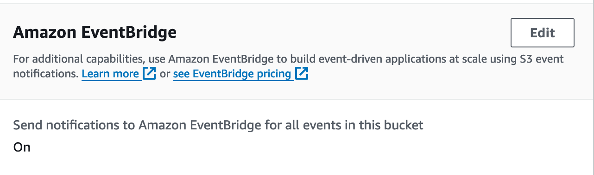
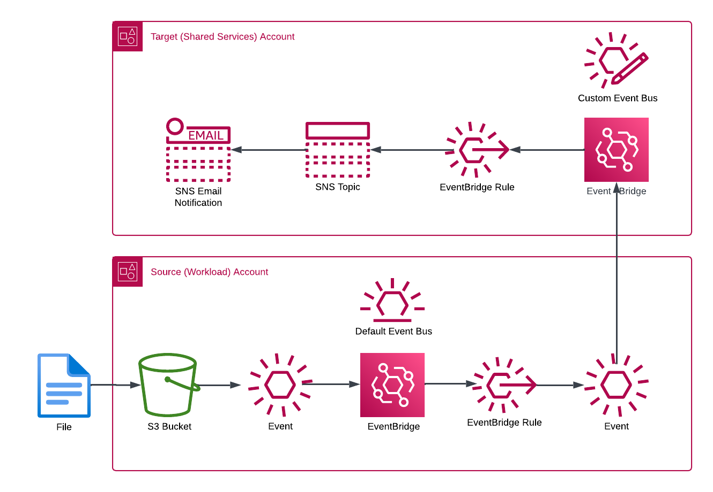

# Cross Account Event Bridge example

## Assumptions

* The Target and Workload Accounts are members of the same AWS Organization
* One or more S3 Buckets in the workload account(s) has the Event Bridge notifications turned on


## Deployment

### Tunning the CloudFormation templates

The commands below can be used to run the CloudFormation Templates.  The template for the target account should be  run first, to create the  custom event bridge bus needed by the workload accounts.

#### Parameter File Updates

##### target-account-parameters.json

Parameters Values must be supplied for the NotificationEmail and the OrganizationId.

The SNS Topic and Event Bridge parameters are populated with default values that can be updated if desired.

##### workload-account-parameters.json

The TargetAccountId, which is the ID of the account where the centralized Event Bus was created.

The TargetEvenBus **must** match the name used for the Event Bus created in the target account. (Target Account parameter EventBusName)

#### Target Account (Shared Services)

```shell
aws cloudformation deploy --template-file ./target-account.yaml --stack-name cross-account-s3-eventbridge-notifications --parameter-overrides file://./target-account-parameters.json --capabilities CAPABILITY_NAMED_IAM
```

#### Workload Accounts


```shell
aws cloudformation deploy --template-file ./workload-account.yaml --stack-name cross-account-s3-eventbridge-notifications --parameter-overrides file://./workload-account-parameters.json --capabilities CAPABILITY_NAMED_IAM
```

## Workflow



1. An object is uploaded to an S3 Bucket which has Amazon EventBridge notifications enabled
2. The creation of the object triggers an EventBridge Event on the default EventBus in the account
3. The EventBridge rule in the workload account creates an event the is sent to the custom event bus in the target account
4. An EventBridge Rule in the target account pushes the received information to an SNS Topic
5 A generated SNS Email is sent to all subscribers to the Topic
